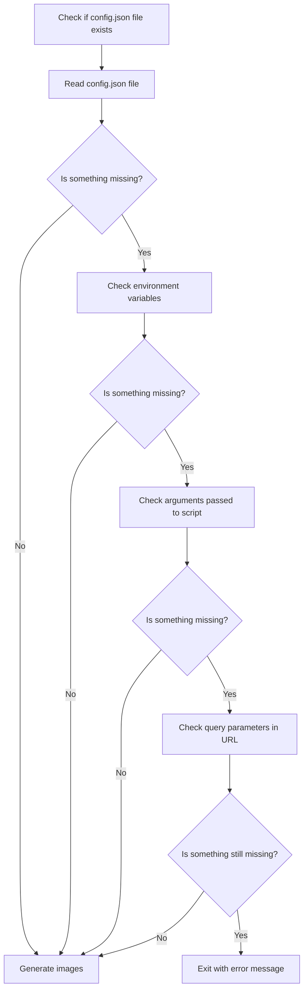

# Configuration Flow Visualization

<!-- https://docs.github.com/en/get-started/writing-on-github/working-with-advanced-formatting/creating-diagrams -->

<!-- TODO: Need to correct flow after last changes in script -->

